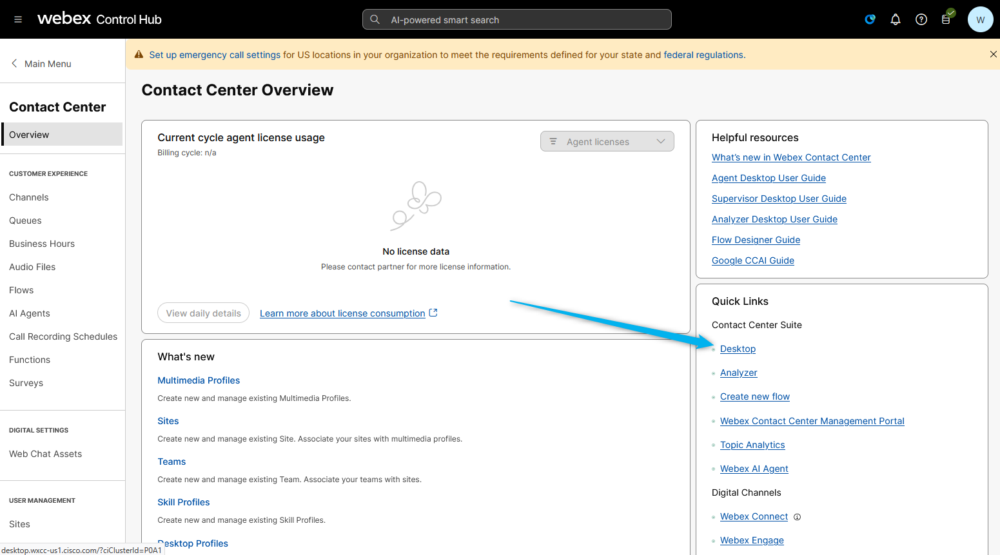

# Mission 1: Configure Suggested Responses with Knowledgebase.

## Mission overview
Your mission is to:

Create a Knowledge Base for the AI Assistant skill to use. This knowledge base will contain document will provide the necessary information for the AI Assistant to knowledgeably provide suggestions to the agent.

---

## Build

### Task 1. Create Knowledgebase. 

1. [IMPORTANT] Download .xlsx the file [Flowrs_Catalog](https://docs.google.com/spreadsheets/d/1QjbL58okbEfl-ODgyv_ohIIPUiPBP34n/edit?usp=sharing&ouid=100862210011127627593&rtpof=true&sd=true){:target="_blank"}.
    
    
    > 
    > **Flower_Catalog.xlsx** - file contains information on the available single flowers and bouquets, including the price of the flowers or bouquets and occasions that suit the flowers.
    >

2. Open up and review the file. 
    

3. From Control Hub, go to Contact Center and open **Webex AI Agent Studio** portal.
    

4. Select **Knowledge** and click on **Create Knowledge base**.
    

5. Provide the name as **<copy><w class="attendee"></w>_Suggested_Responses_Knowledge</copy>** and click on **Create**.
    

6. Add **Flower_Catalog** file. The same file that you used for the Autonomous AI Agent lab.
    

7. Process the file. 
    

### Task 2. Creat AI Assistant skills.

1. Select **AI Dashboard** and click on **Creat skills**.
    

2. Select **Start from scretch** and click **Next**.
    

3. Name the skill as **<copy><w class="attendee"></w>_Suggested_Responses_Skill</copy>**. Discribe the goals as **<copy>Answer question about flower suggestion, flower availability, prices, delivery cost and order status.</copy>**. And then click on **Creat**.
    

4. Link the knowledge base to the skill in the **Knowledge** section. **Save** and **Publish** the changies. 
    

### Task 3. Assigned AI skills to your queue.  

1. In the Webex Control Hub, go to Contact Center, scroll down until you see the **AI Assistant** module. Open it and scroll down to the **Suggested Responses** feature. Click on Assign AI Assistant skills. In the following window, select the skill that you created in the previous tab, **<copy><w class="attendee"></w>_Suggested_Responses_Skill</copy>**, and add your queue **<copy><w class="attendee"></w>_2000_Voice_Queue</copy>**. Then click **Save**.
    

### Task 4. Add "Start Media Stream" block to the voice flow. 

1. In the Webex Control hub find and open your flow, **<copy><w class="attendee"></w>_SR_Voice_Flow</copy>**.
    

2. Click on **Edit**. 
    

3.  Select **Event Flows**. Drag and drop **Start Media Stream** block and connect **AgentAnswered** block to the **Start Media Stream** block. Drag and drop **End Flow** node and connect **Start Media Stream** block to the **End Flow** block. 
    

4. Validate and Publish the flow with **Latest** task. 
    

### Task 5. Test Suggested Respondes Feature.

1. Log in to the Agent Desktop.
    

2. Place the call to the number that is related to your Channel.

3. Once the call is connected to your Agent Desktop, click on the AI Assistance module. You will see the option **Get Suggestion**. Click on it and try to order some flowers. You should see that the AI Agent will suggest flower availability and prices to the human agent based on the Knowledge Base.
    