### Inbound Flow Configurations. 

Before you test Suggested Responses, we need to configure basic inbound call flow. 

### Task 1. Configure new Team. 

1. Login to [Control Hub](https://admin.webex.com){:target="_blank"} with your admin credentials.

2. Go to Contact Center service.
    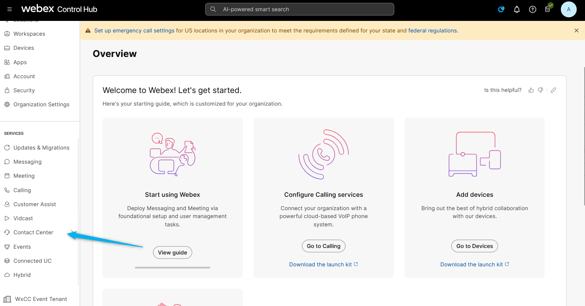

3. Find Team section. 
    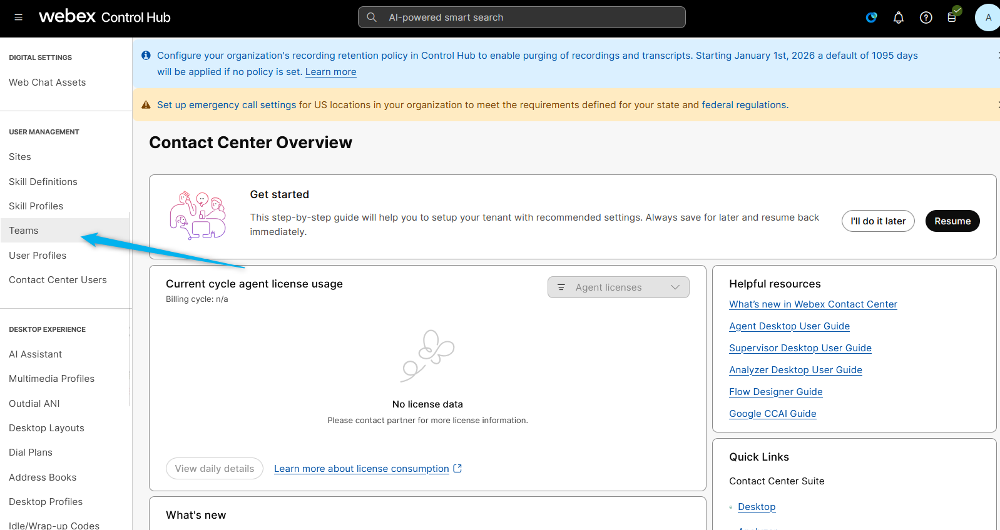

4. Create new Team with name **<copy><w class="attendee"></w>_SR_Team</copy>**
    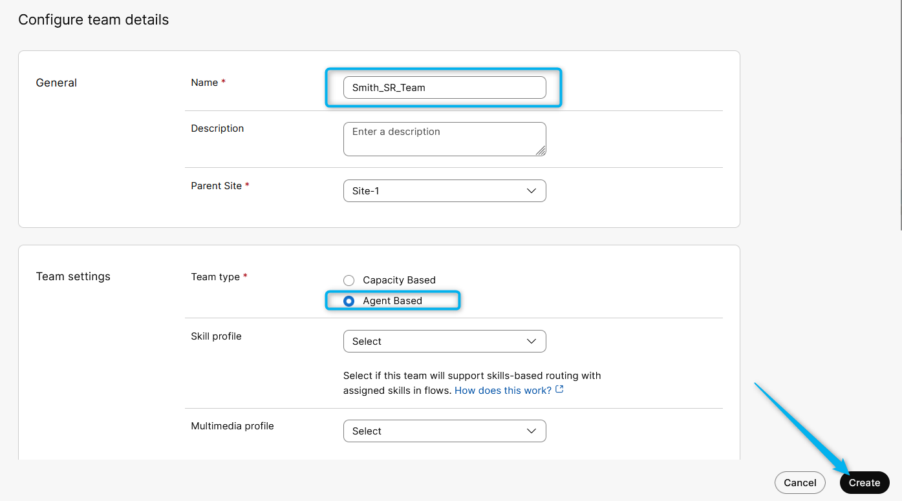

5. Open up the team you have just created and add your user to the team. 
    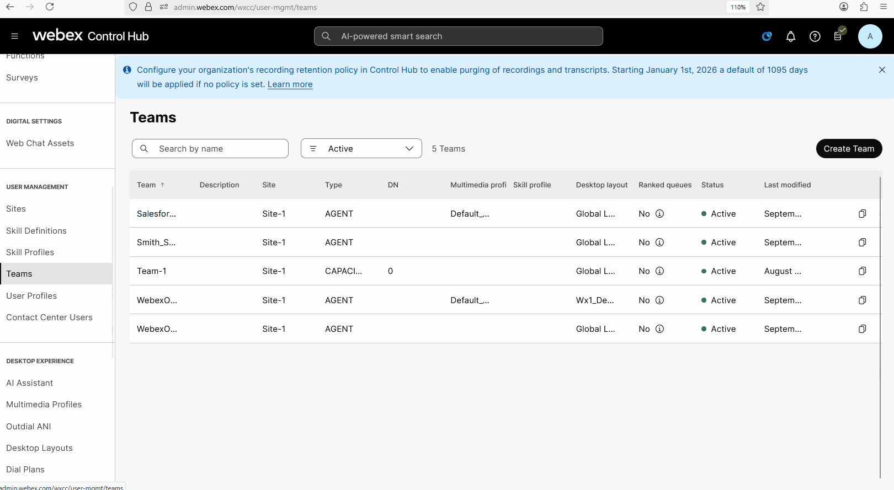

### Task 2. Configure new Queue. 

1. Find Queue section and click on **Create a queue**.
    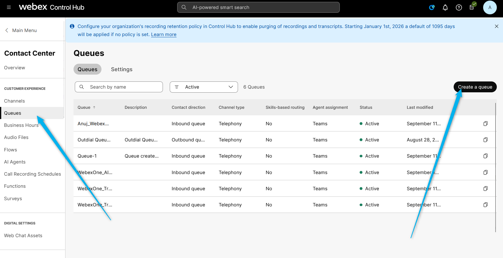

2. Name the queue as **<copy><w class="attendee"></w>_SR_Voice_Queue</copy>**.
    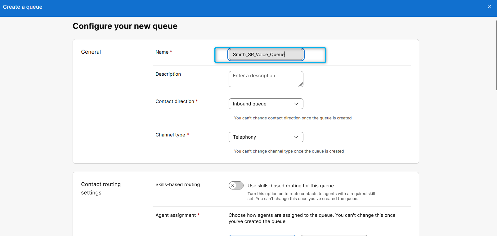

3. Scroll down until you will see **Create a group** section. Add your team that you created in the previouse Task to this team. 
    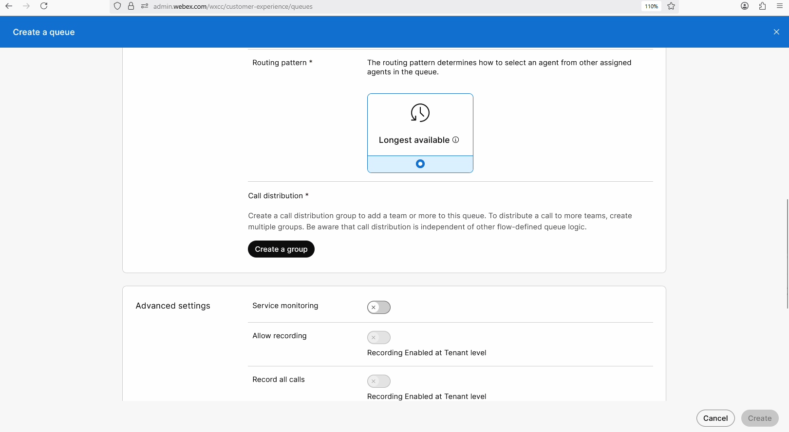

4. Configure Service level, Max time in queue and Default music in queue, then click **Create**
    

### Task 3. Configure new Flow.

1. Find Queue section and click on **Create Flows**.
    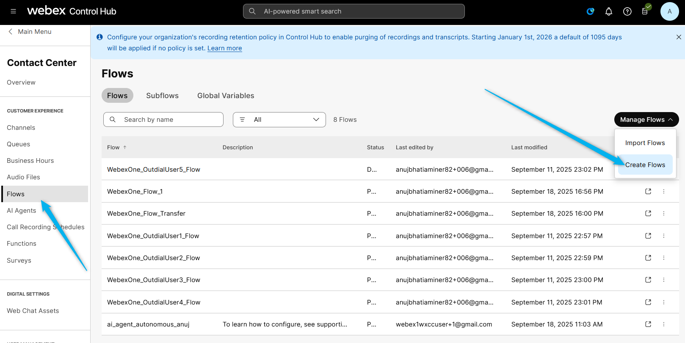

2. On the next window select **Start Fresh**. 
    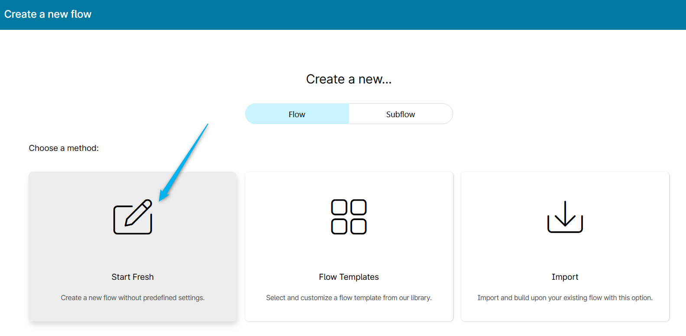

3. Name the flow as **<copy><w class="attendee"></w>_SR_Voice_Flow</copy>**. Then click on **Creat Flow**.
    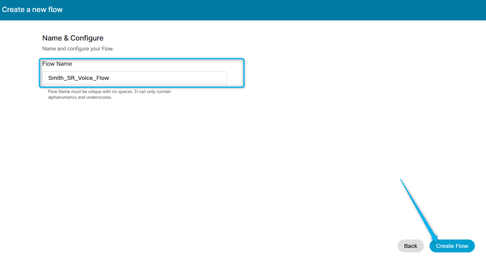

4. Open up flow. Click on Edit and add **Queue Contact** node. Select the queue: **<copy><w class="attendee"></w>_SR_Voice_Queue</copy>** , that you have created earlier.
    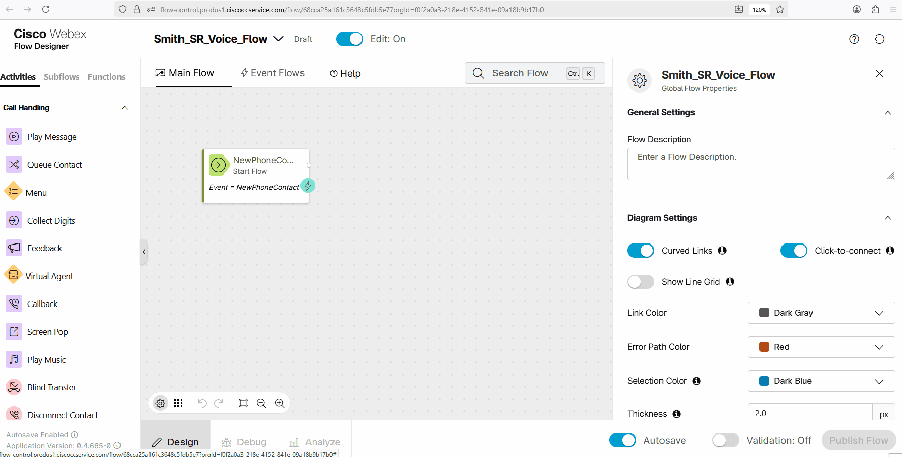

5. Add **Play Music** node. Connect **Queue Contact** node to the **Play Music** node. Loop **Play Music** node to itself. Select default music in queue file in the **Play Music** node. 
    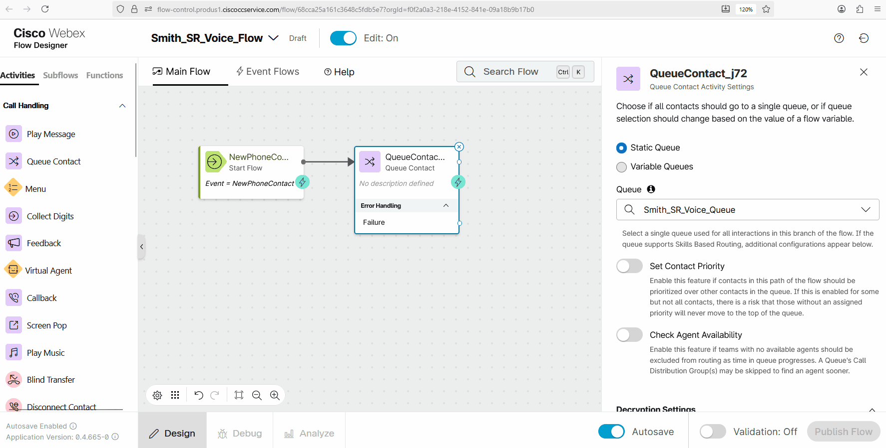

6. Validate and Publish the flow with **Latest** label. 
    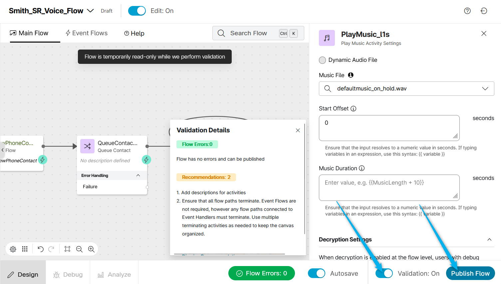

7. Go to Channels, and consult with the proctor which Channel to select to continue with the lab. 
Channel_Suggested_Rerponses_1  
Channel_Suggested_Rerponses_2  
Channel_Suggested_Rerponses_3  
Channel_Suggested_Rerponses_4  
Channel_Suggested_Rerponses_5  
    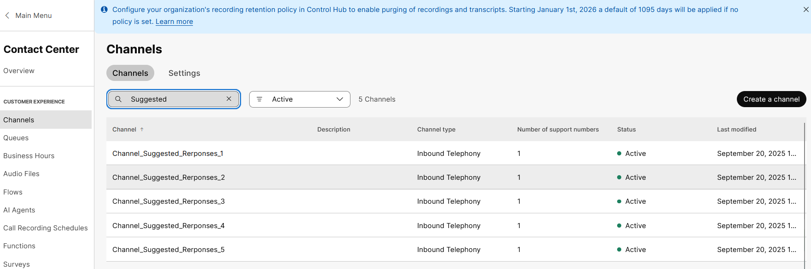

8. Note what number is assositaed with your Channel. You will use it for furhter testings. 
    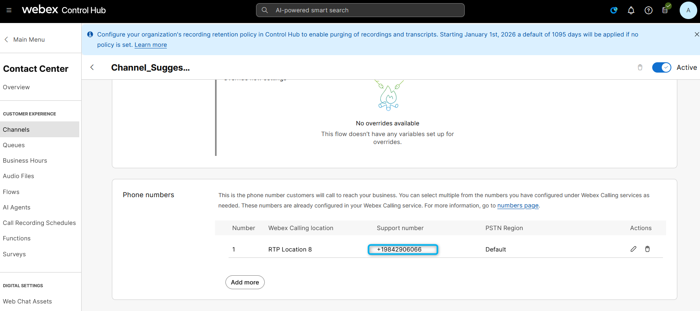

9. Open up the Channle and select the the flow **<copy><w class="attendee"></w>_SR_Voice_Flow</copy>**. Select a Music on hold file and lable as **Latest**
    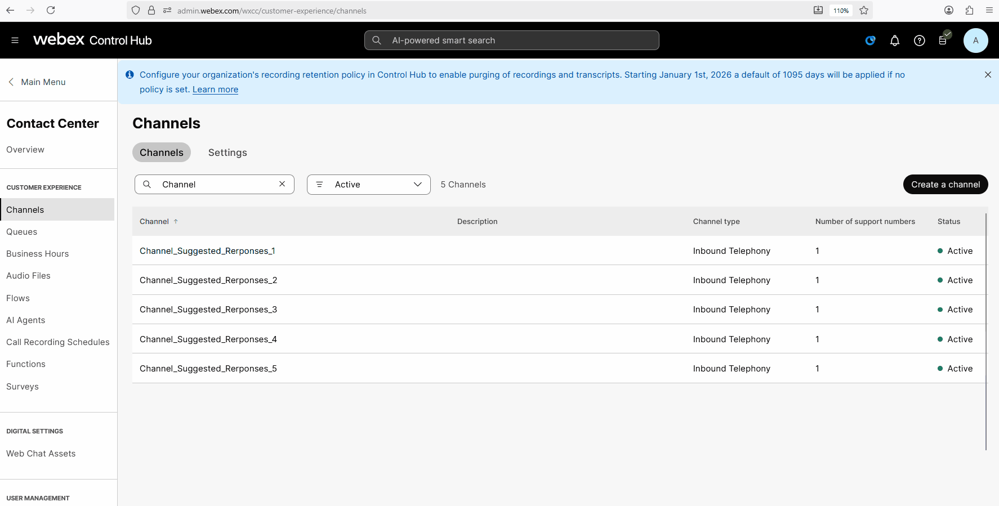

10. At this point you should have the following configurations:

> Entry Point/Channels:  **Check with proctor**

> Flow: **<copy><w class="attendee"></w>_SR_Voice_Flow</copy>**

> Queue:  **<copy><w class="attendee"></w>_SR_Voice_Queue</copy>**

> Team:  **<copy><w class="attendee"></w>_SR_Team</copy>**

### Task 4. Test inbound call delivery to the Agent Desktop. 

1. Login to the **Desktop**. You can do it from **Quick Links** section. 
    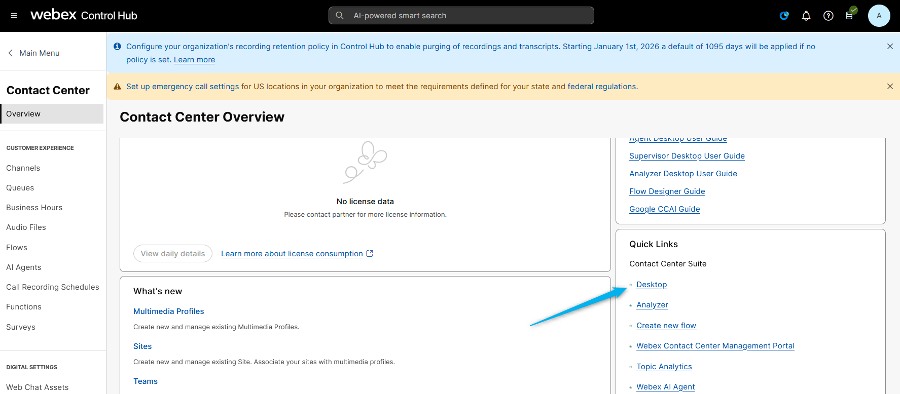

2. Select **Desktop** telephony option, make sure you select your team **<copy><w class="attendee"></w>_SR_Team</copy>** and click on **Submit**. 
    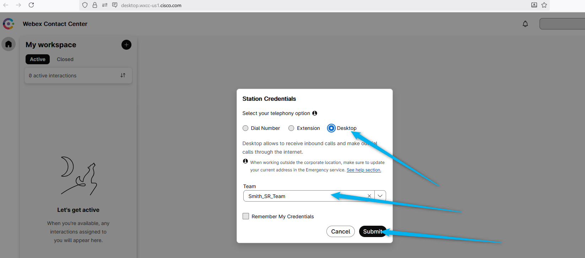

3. Change the state to **Available**.
    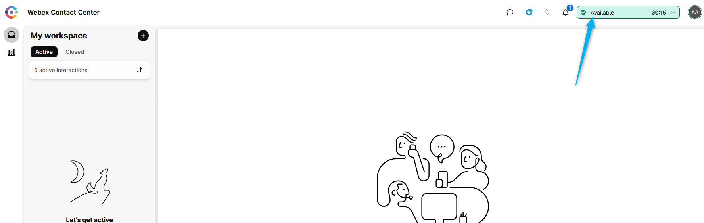

4. Call the number that is assosiated with the Channel that you use for this lab. 
    

5. Answer the inbound call
    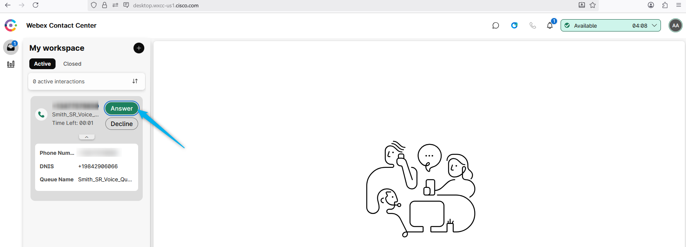

6. If you are able to answer the call you can continue to the **Suggested Responses** lab. 

<strong>Congratulations, you have officially completed Getting Started section! 🎉🎉 </strong>

