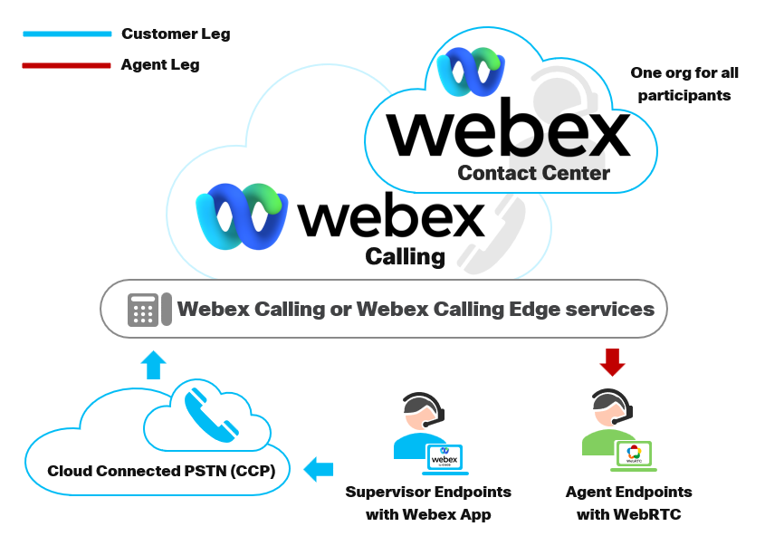
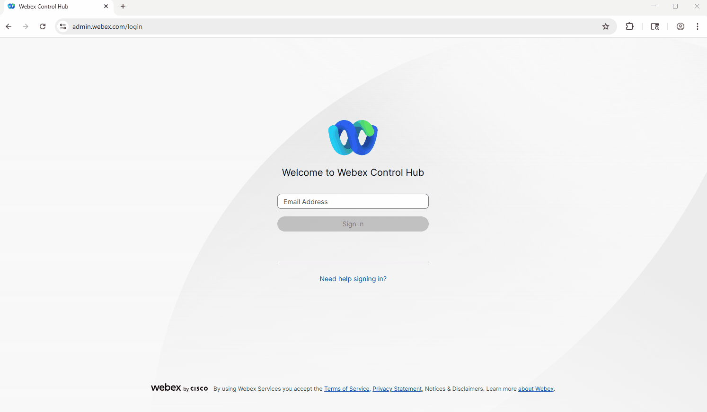
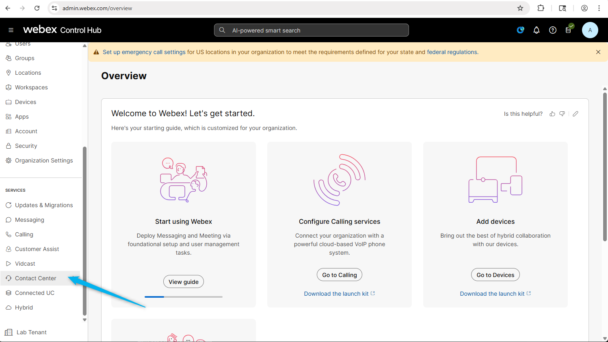
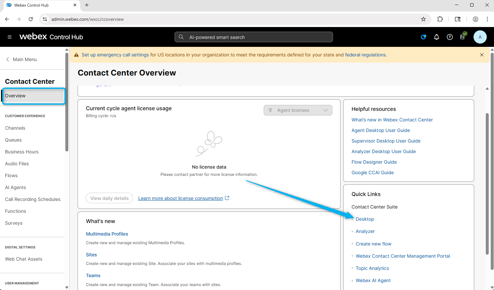
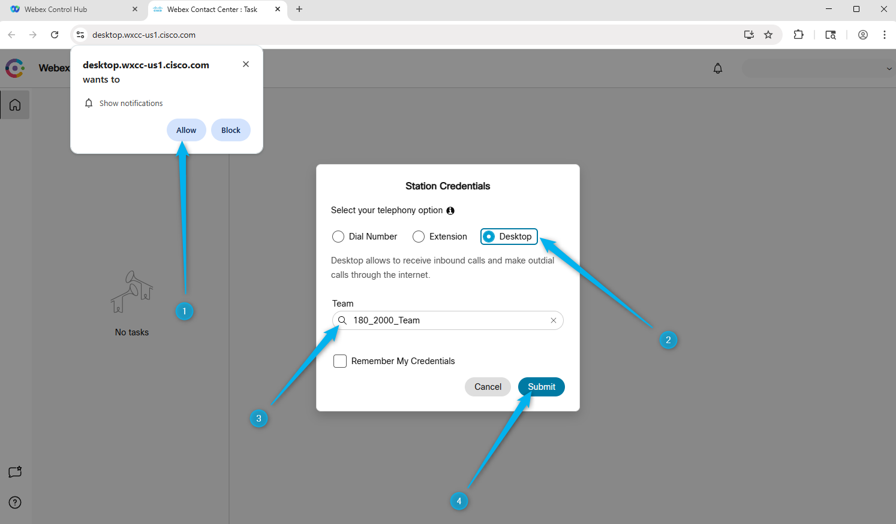
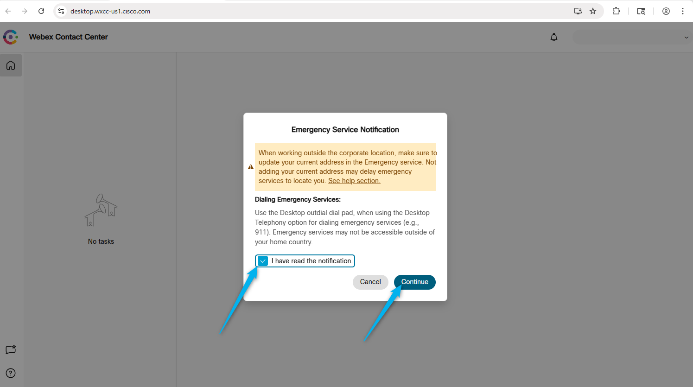
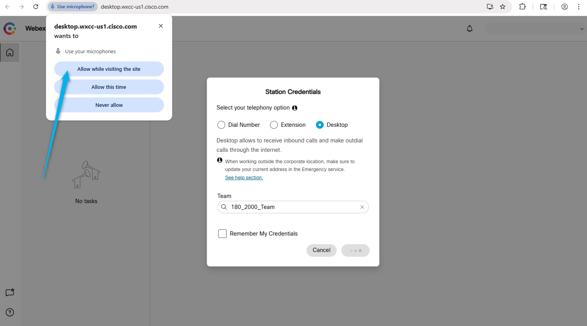
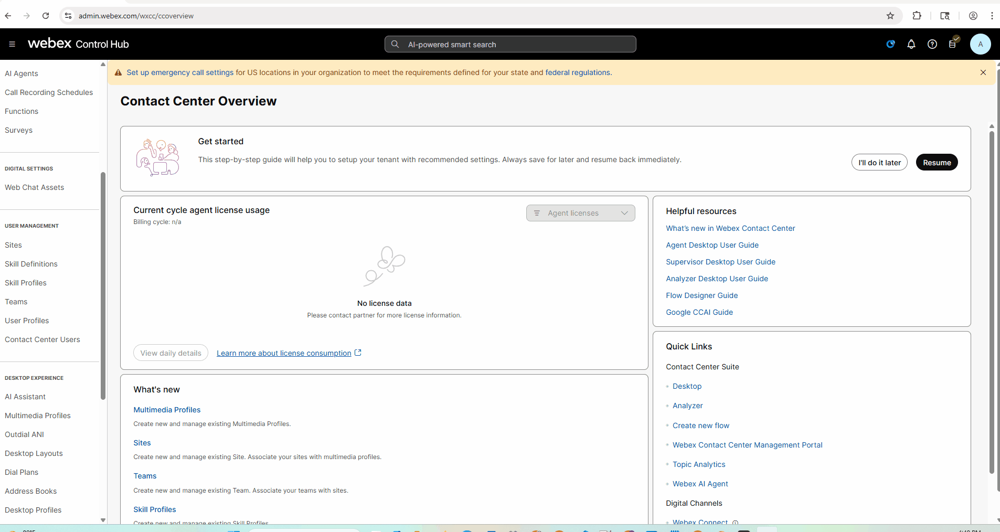

## Learning Objectives
1. Ensure that you have **LAB2342_Credential** file on your desktop with instructions and credentials to access your lab. If you do not, please ask your lab proctor now.
2. Understand your configuration instructions

### Know before you start

1. We will be using a shared lab tenant for simulations, meaning all attendees will work within the same Webex Contact Center environment. To avoid conflicts, ensure that any entities you configure are tagged with the Attendee ID assigned to you.
    
    

WxCC Schema

2. The majority of the configuration in Control Hub is already set up, allowing you to focus primarily on configuration Webex AI Virtual Agent and other AI features. Of course, there may still be some elements to adjust, but these should be minimal, letting you concentrate on building and refining the flow logic rather than spending time on initial setup.
3. The Human Agent have been configured for you. You will be performing the rest of the configurations for AI Agent and integartion with channels.
4. All your configurations should contain your attendee ID so the lab users don't step over each other's configurations.
5. Each of you has been provided with the phone number to dial (Entry point DN), 1 agent and 1 admin.
6. Please ask for help when you need it. You can do so by: 
Dropping your question in the LAB Space **LAB-2342: In Room Lab Support** from Webex App in your Lab PC.  
Raising your hand and calling the proctor. 
---

### Predefined configuration

> Entry Point/Channels:  **<copy><w class="attendee"></w>_2000_Channel</copy>**

> Queue:  **<copy><w class="attendee"></w>_2000_Voice_Queue</copy>**

> Team:  **<copy><w class="attendee"></w>_2000_Team</copy>**

> Admin:   **<copy>wxcclabs+admin_ID<w class="attendee"></w>@gmail.com</copy>**

> Webex App has been pre-installed on your Lab PC

> Assigned Inbound Channel Number: **Provided by Lab Instructor**

More pre-configured entities will be mentioned during the lab missions if they have any.

---

### Testing

#### Login to Webex Control. 

1. Open up Google Chrome Web browser and start login to [Control Hub](https://admin.webex.com){:target="_blank"}.
   

2. Login using your Admin user name and password. 
   

#### Login to Agent Desktop

1. Click on **Contact Center** Service. 
   

2. From **Quick Links** click on **Desktop**.
   

3. Allo notification for the Aget Desktop. Select login option as **Desktop**, select your Team and click on **Submit**.
   

4. Click Continue on the Emergency Serice Notification. 
   

5. Allow use of microphones.
   

#### Calling to Contact Center
You can make test calls from your mobile phone or by using Webex Calling phones. Please find the Webex App and log in with the admin credentials that were shared with you.
   

Place test call to the test number  +15206603129 to confirm that you Webex Phone is configured to place calls

!!! Note
    International dialing is not allowed so you won't be able to dial your cell phones unless you have a US number.

---

