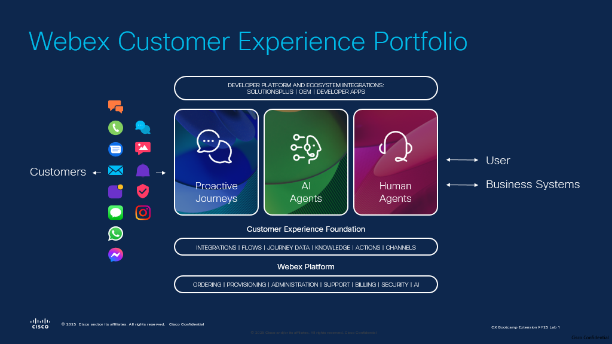

<!-- Markdown content with embedded HTML -->

    <h2>Please submit the form below with your Attendee ID.</h2> 
    <h3>All configuration entries in the lab guide will be renamed to include your Attendee ID.</h3>
    <form id="info">
        <label for="attendee">Attendee ID:</label>
        <input type="text" id="attendee" name="attendee" placeholder="Last Name" required>
        <button onclick="setValues()">Save</button>
    </form>

     

    
Your stored Attendee ID is:<w class="attendee"> No ID stored</w>

# Overview

## Use Case 

## Webex AI Agent Design for Flower Shop

Designing a **Webex AI Agent** for a flower shop to assist customers via **voice and digital channels**.

### AI Agent Capabilities

- **Recommending flowers** based on customer preferences or occasions  
- **Collecting order details** for both **standard and custom bouquets**  
- **Calculating total price** in real time  
- **Gathering delivery information**, including **address** and **delivery date**  
- **order confirmations via SMS**  
- **Providing order status updates** upon request  
- **Sharing store hours** and relevant **business information**  
- **Transferring to a human agent** when needed for complex inquiries  

### Human Agent Support

- **Human agents** are equipped with **AI-powered tools** to ensure:
  - **Fast issue resolution**  
  - **Personalized service**  
  - **Exceptional customer experience** across all interactions

## Learning Objectives

Welcome to **"Hands-on AI in Action with Webex Contact Center: Enhancing Self-Service, Agent Assistance & Customer Insights - LAB-2342"**

In this lab, participants will:   
 **• Uncover Trends & Opportunities:** Analyze customer conversation data to identify key themes, trends, and automation opportunities for improved service efficiency.   
 **• Integrate Intelligent AI Agents:** Utilize Cisco Autonomous and Scripted AI Agents to build dynamic, context-aware self-service flows that adapt to customer needs in real-time.   
**• Seamless AI-to-Human Collaboration:** Experience smooth transitions from AI agents to human agents, ensuring continuous context and interaction summaries for effective issue resolution.   
**• Enhance In-Interaction Insights:** Experience AI-driven call summarisation to enhance agent productivity and service quality.   
**• Predict Customer Sentiment:** Learn to leverage AI to forecast customer satisfaction (CSAT) based on interaction data, enabling proactive service adjustments and how to use this for proactive customer engagement.   
**• Utilize Proactive Campaign:** Proactively engage customers through intelligent outreach and dynamic self-service using Webex AI Agents.

    
## Disclaimer
The lab design and configuration examples provided are for educational purposes. For production design queries, please consult your Cisco representative or an authorized Cisco partner.
Let’s get started and discover how **Webex Contact Center Flow Designer** takes customer experiences from good to great!

